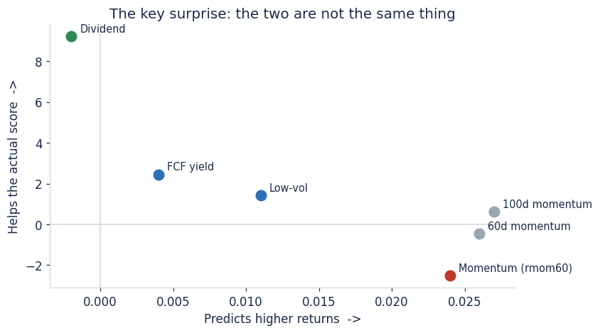
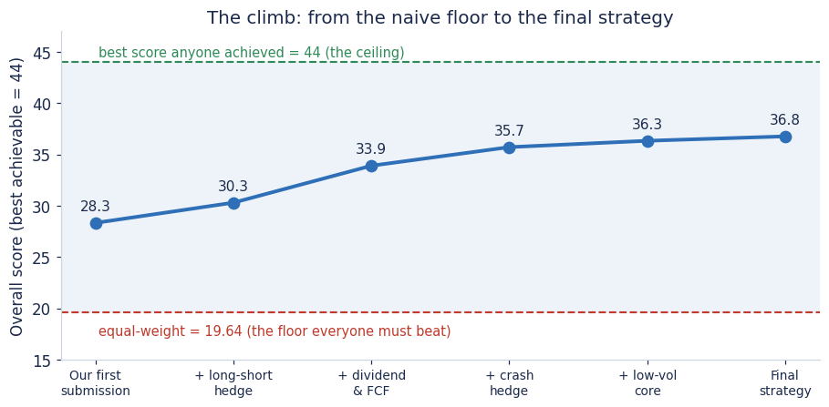
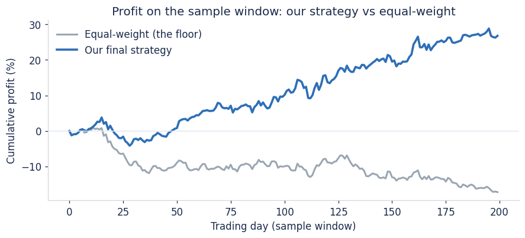
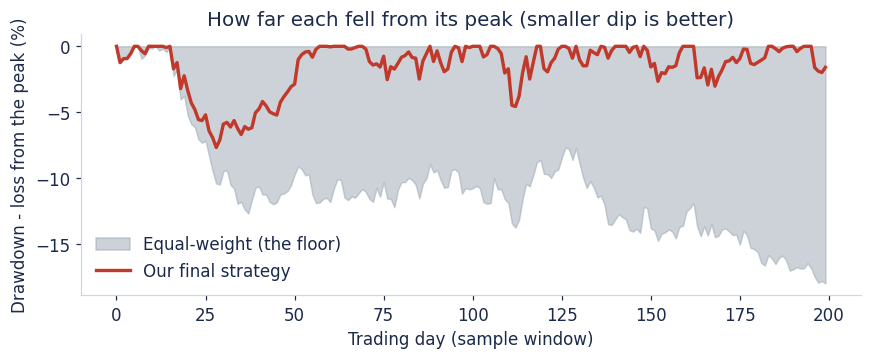

# Regime Navigator

A portfolio of 100 stocks, rebalanced weekly, run through market conditions that
aren't known in advance. The objective isn't the highest return — it's consistent,
risk-adjusted growth: doing well across very different market environments rather
than winning one and blowing up in another.

## The central idea

What makes money and what protects it are two different things. Momentum drives the
returns, but on its own it crowds into volatile names and takes deep losses. Dividend
income and a lean toward steady, low-volatility names add little return but do most
of the work limiting the drawdowns — and on a consistency objective, that matters more.

I selected signals by how much they improved risk-adjusted performance, not by how
well they predicted next-week returns. Those two rankings point in different
directions: the strongest return predictors (momentum) barely moved consistency,
while dividend yield — almost the weakest return predictor — was the single biggest
contributor to cutting drawdown.

## How it works

1. **Read the regime.** Each week the market is classified from its trend (level vs
   its 50-day average), breadth (fraction of names above their 20-day average), a
   volatility/fear gauge, and drawdown from the running peak. These feed a priority
   cascade — the first condition that fires sets the regime (crash, defensive,
   low-vol rotation, steady-boom, or normal momentum).
2. **Rank every stock** on momentum, dividend income and steadiness.
3. **Size by conviction** — weight is the stock's score times capped inverse
   volatility, so a calmer name gets more than an equally-ranked jumpier one, under
   strict per-name and sector caps. Score leads; steadiness only breaks ties.
4. **Protect in stress** — in a downturn the book moves toward low-volatility,
   low-beta, dividend names and adds a short hedge on the weakest stocks; in a deep
   crash it switches to a low-beta-long / high-beta-short book. Net exposure steps
   down as the regime turns dangerous and back up as it turns safe.

Regime changes are confirmed before acting (fast to go defensive, slow to come back),
so the book isn't whipsawed by a single noisy week.

## Results

Across the sample windows the strategy delivers roughly double the return of an
equal-weight book with a smaller worst loss. It's built to generalise: every signal
is causal (no look-ahead), it stays inside all position/sector/leverage limits with
margin, and it was stress-tested against pathological inputs (most names delisting,
missing data, a crash from the first day).

The honest weak case is a correlated, flight-to-safety crash where everything falls
together: a mandated net-long book can fall slower but can't reach flat. The natural
extension is cross-asset and macro hedges, which the single-asset universe here
didn't allow.

## Files

- `solution.py` — the full strategy (regime detection, ranking, sizing, hedging).
- `figures/` — the figures above, plus base-strategy comparison and feature importance.
