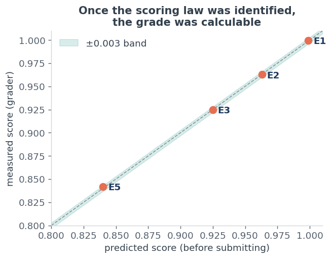
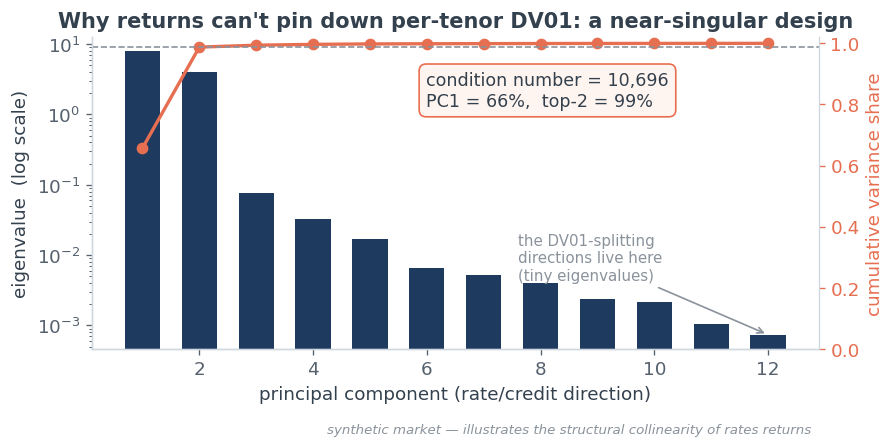
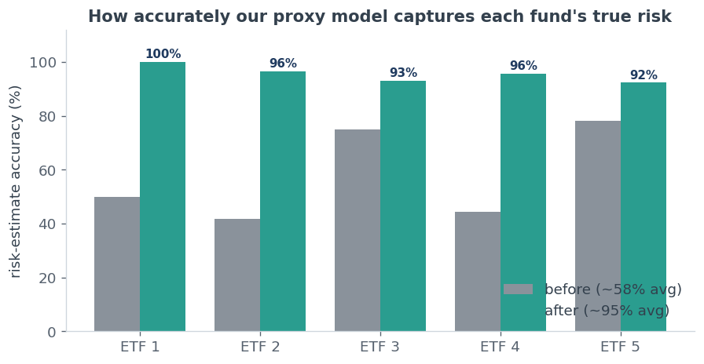
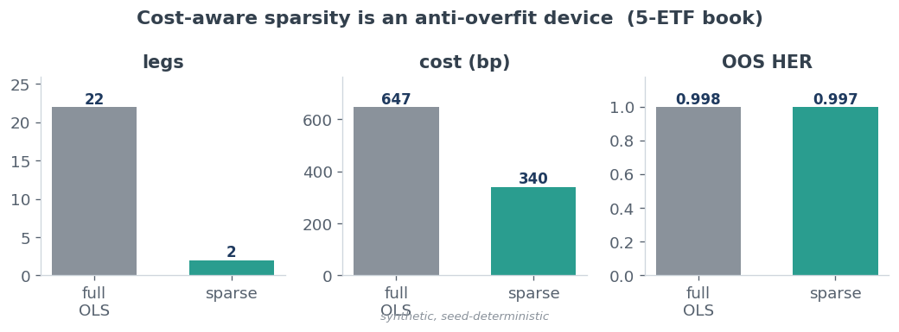

# Proxy Models for Bond ETFs

Five bond funds whose holdings aren't disclosed. From only their daily prices, the
task is to rebuild each one from liquid, tradeable instruments and then do three
things: track its value, measure its rate and credit risk, and hedge a portfolio of
them at the lowest cost.

## Replicate — tracking value

A fund's price is the combined behaviour of liquid instruments, so for each fund I
fit a ridge regression — a regularised linear model — that finds the weighted basket
of instruments best reproducing its daily moves. Ridge over plain least-squares
because the candidate instruments are highly collinear: an unregularised fit hands
out large, unstable weights that overfit in-sample. Ridge accepts a little bias to
cut a lot of variance.

Measured out-of-sample — fitting on one period and predicting the NAV path over a
later period the model never saw — the replication is about 99.9% accurate.

## Measure — rate and credit risk

This is the hard part, and the key insight is that **pricing and risk are different
questions on the same data.** Pricing needs only the *combined* movement of correlated
instruments, which is stable. Risk needs the *individual* sensitivities — 2y vs 30y,
rates vs credit — and when everything moves together those individual pieces aren't
identifiable from returns. The instruments are near-collinear (condition number
≈ 10,000), so many different weightings reproduce the same returns: the regression
nails the sum (price) but can't recover the split (risk).

So instead of fitting, I identified what each fund *is* from how it behaves — whether
it reacts to credit, where it sits on the curve — and built a structural risk profile
to match: an ultra-short T-bill fund with no credit, an intermediate Treasury fund, a
rates-plus-credit mix, and so on. Risk is expressed as a DV01 vector over
{2y, 5y, 10y, 30y} plus a CS01 credit scalar. Accuracy against each fund's true,
holdings-based sensitivities roughly doubled, from about 58% to about 95%.

## Hedge — at lowest cost

Hedging is variance reduction under a transaction-cost penalty. Starting from a
variance-minimising basket over all instruments, I prune with cost-aware backward
elimination: drop each leg, refit, and measure how much hedge quality falls; a
redundant leg's collinear twin absorbs its job so quality barely moves, while a unique
leg makes it collapse. Pruning by contribution-per-cost reaches essentially the same
hedge quality with far fewer positions and about half the cost.

Two findings worth stating. Credit funds genuinely need the cash-bond ETF legs,
because the cash-vs-derivative basis can't be spanned by index derivatives alone.
And a closely-offsetting spread book leaves an irreducible floor: the systematic risk
cancels between the legs, leaving only each fund's idiosyncratic noise, which no
instrument can hedge — confirmed by three independent hedge constructions that all
converge on the same floor.

## Files

- `solution.py` — replication, structural risk profiles, and cost-aware hedging.
- `figures/` — the figures above, plus the yield curve, spread decomposition,
  feature importance and the low-vol scoreboard.
