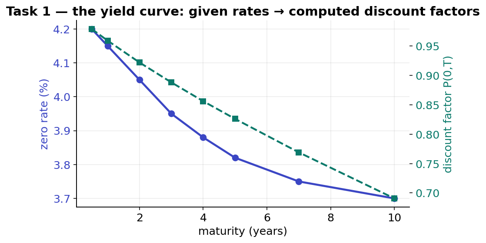
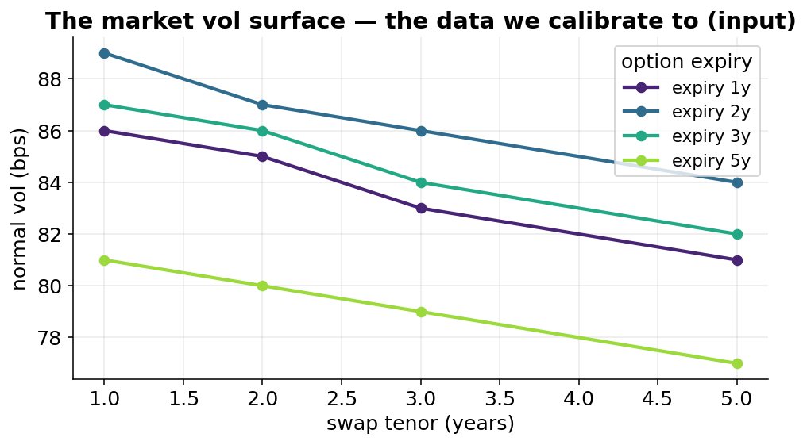
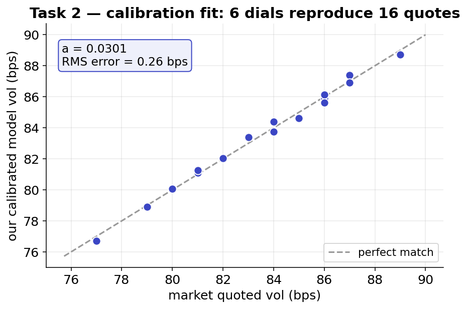
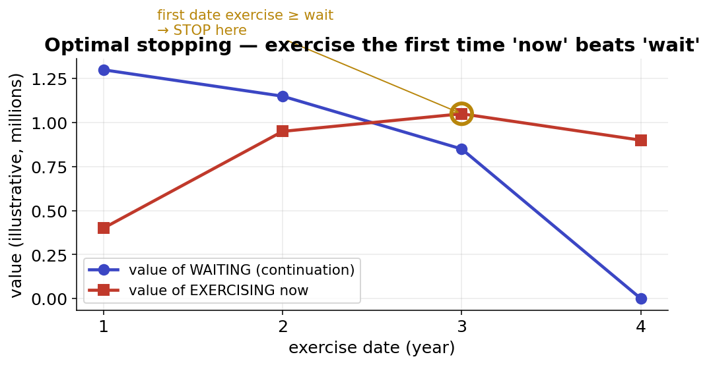
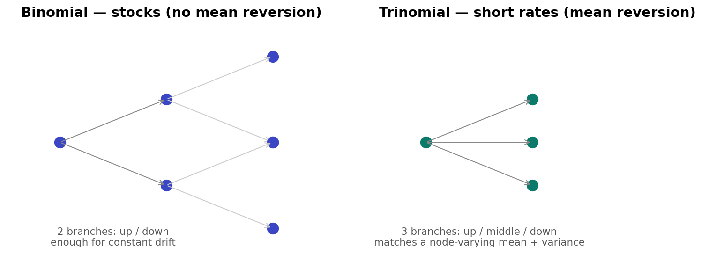
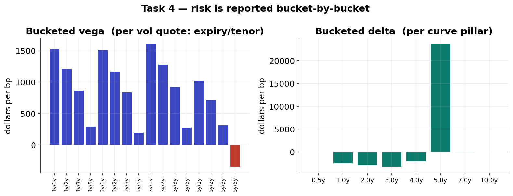

# Pricing a Bermudan Swaption

A client holds a co-terminal Bermudan payer swaption — the right, on any one of
several future dates, to enter a swap paying fixed and receiving floating, with every
swap ending on the same date. Economically it's a flexible position on rising rates,
where the holder also chooses *when* to commit. The task is to price it and measure
its risk, built from first principles.

The work is four steps, each feeding the next: build the curve, calibrate the model,
price the early-exercise feature, and compute the risk.

## Curve

The quoted rates are turned into discount factors — the value today of a future
dollar — in closed form and arbitrage-free by construction. Everything downstream is
priced on this.

## Calibrate

I calibrate a one-factor Hull–White model to the market's volatility surface. Six
parameters — a mean-reversion speed and a piecewise volatility term structure —
reproduce all sixteen European swaption quotes to under a basis point.

Six parameters fitting sixteen quotes is the opposite of overfitting: with so few
controls you can't match sixteen prices at once unless the model genuinely captures
how the market moves, and the parameters come out smooth and economically meaningful
(mean reversion ≈ 0.03). Hull–White is chosen because it is one-factor and Gaussian,
which gives a closed form for the simple swaptions (fast calibration), a clean
recombining tree for early exercise, and an exact fit to the curve.

## Price

Pricing the Bermudan is an optimal-stopping problem. On a trinomial lattice fitted to
the curve, at each exercise date I compare exercising now against the value of
waiting, and exercise the first time acting beats waiting. Rolled backwards through
the tree, that single comparison captures the early-exercise premium — the value of
the holder's flexibility. The tree is trinomial rather than binomial because rates
mean-revert, so the expected next move varies node to node and needs the third branch.

The lattice price is cross-checked against a closed-form result and an independent
Monte-Carlo, and the three agree.

## Risk

Delta and vega are computed by re-pricing under shifted markets. Vega in particular
re-calibrates the model to the bumped volatility surface before re-pricing, because a
volatility quote only enters the price through the parameters it implies. Across
stress scenarios every sensitivity moves in the economically correct direction — the
payer gains when rates rise and when volatility rises.

## Limitations

A perfectly flat volatility surface leaves mean-reversion undetermined (recognised and
handled), and one factor captures the level of rates but not every change in their
shape. A two-factor (G2++) model is the natural next step for richer curve dynamics.

## Files

- `solution.py` — curve, Hull–White calibration, trinomial-lattice pricing, and risk.
- `solution_pde.py` — an alternative finite-difference / PDE pricing engine.
- `figures/` — the figures above.
